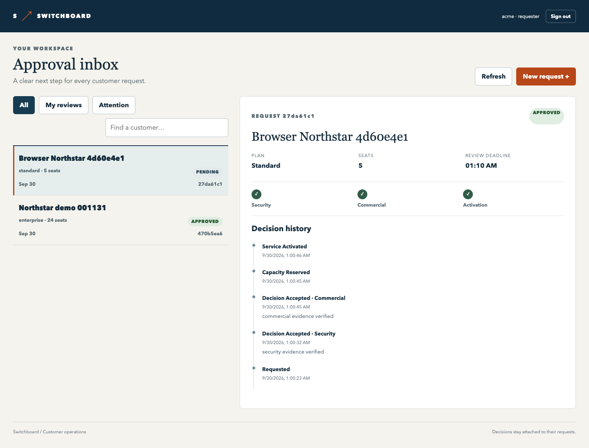

# Switchboard

A customer-onboarding desk with durable human approvals. Security and commercial reviewers decide in sequence; provisioning begins only after approval. Worker restarts, repeated requests and provider failures have explicit recovery behavior.



Built with React 18, TypeScript, Express, Temporal 1.17.1, PostgreSQL 13 and Keycloak 18.

## Run

Use Node 16.16, Python 3 and Docker Compose. Allocate at least 3 GB to the supporting containers.

```sh
python3 scripts/bootstrap.py
npm ci --no-audit --no-fund
npm run build
docker compose --env-file .local/docker.env -p switchboard-2022 up -d
python3 scripts/local.py start
```

Open **http://localhost:4900**. Find generated demo passwords in `.local/credentials.json`. Sign in as `requester`, create an onboarding request, then use `security` and `commercial` in separate browser sessions to review it. `operator` can inspect tenant-wide work and cancel a pending process. `python3 scripts/demo.py` runs the same approval path through the authenticated API.

## What it demonstrates

- Multi-stage approvals, durable reminders/deadlines and an operator attention queue.
- Tenant/role/ownership checks, no self-review, stale-decision rejection and durable decision receipts.
- Repeat-safe request admission and transactional provider effects, including lost-response recovery.
- Cancellation, reverse compensation and guarded manual cleanup when compensation fails.
- Worker restart recovery, saved-history replay and bounded concurrent workflow measurements.
- Responsive request/review screens with keyboard controls and preserved retry identities.

The provider is a local service backed by real PostgreSQL transactions. It models capacity reservation and activation; it does not provision a commercial cloud service.

## Verify

```sh
python3 scripts/install-test-server.py
npm test
npm run build
npm run test:integration
npm run test:runtime
CHROMIUM_PATH=/path/to/chrome npm run test:e2e
```

Integration tests require PostgreSQL and use the pinned Temporal test server. Runtime tests use the running Temporal container and an isolated task queue/provider fixture. Browser tests require the local app and real Keycloak sign-in. Test data and generated credentials stay in ignored directories.

See the [verification record](docs/verification.md), [architecture and decisions](docs/architecture.md), [operator runbook](docs/operations.md), [API contract](docs/api.md) and [CI guide](docs/ci.md). Original application code is MIT licensed.
