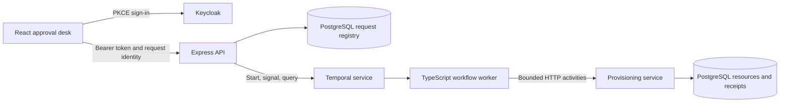
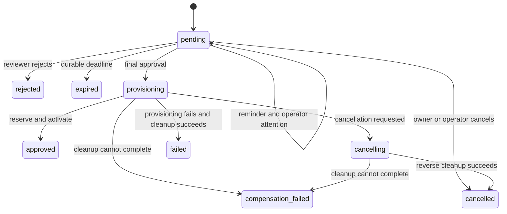

# System and decisions

## ADR 1: Workflow state belongs to Temporal

Signals carry approval/cancellation commands, queries expose snapshots, and durable timers drive reminders and expiry. The registry supplies indexed, tenant-scoped discovery and submission identity; it does not duplicate the workflow state machine. A database admission can succeed before workflow startup does. Retrying the same request key returns the same registry entry and attempts the same workflow identity. Temporal rejects a duplicate start, which the adapter treats as successful recovery.

A `202 submitted` response acknowledges transport acceptance. The browser waits for a durable command receipt to confirm the business outcome. A queued approval followed immediately by cancellation completes as cancelled before any provider activity begins.

## ADR 2: Logical effects are idempotent, physical attempts can repeat

Provider operations lock the request resource and insert a unique `(request_id, operation)` receipt in the same PostgreSQL transaction. A lost HTTP reply can cause a repeated activity; the second call returns the existing receipt. Reusing an identity with a different input fails. Compensation installs tombstones so a delayed activation cannot resurrect a released resource.

This guarantee covers the local provider's transactional resources. An external provider would need an equivalent idempotency contract or reconciliation adapter. It is not a claim of exactly-once HTTP delivery.

## ADR 3: Compensate attempted operations

A timeout can hide a completed write. The workflow therefore reverses every attempted operation, in reverse order, rather than relying only on acknowledged successes. It waits for an in-flight activity before cleanup and exposes `compensation_failed` if cleanup cannot finish. Manual cleanup changes provider state without rewriting the original failed workflow result.

## ADR 4: Trust verified identities at the API boundary

The API verifies RS256 signatures, issuer, audience, expiry and structured tenant/role claims. It derives the actor from the token, never from a submitted actor field. Tenant and ownership checks govern discovery; stage, revision, role and self-review checks also run inside the workflow. Browser PKCE tokens stay in memory. Request and decision identities are isolated in session storage per actor and operation.

Temporal and the provisioning service are trusted internal components in the local deployment. Their Docker ports bind to loopback. Network deployment requires authenticated encrypted Temporal access, managed database credentials and an HTTPS identity/API boundary; the supplied Compose file is a local development environment.

## ADR 5: Bound state and replay before upgrades

The latest 100 audit entries and up to 256 decision receipts are exposed in a workflow snapshot; the full event history remains in Temporal. API mutation limits bound casual command flooding. Histories can be exported with a 100,000-event/20 MB limit and replayed against a candidate worker. Changes that alter durable commands need a compatible workflow versioning/migration strategy before running against older executions.
